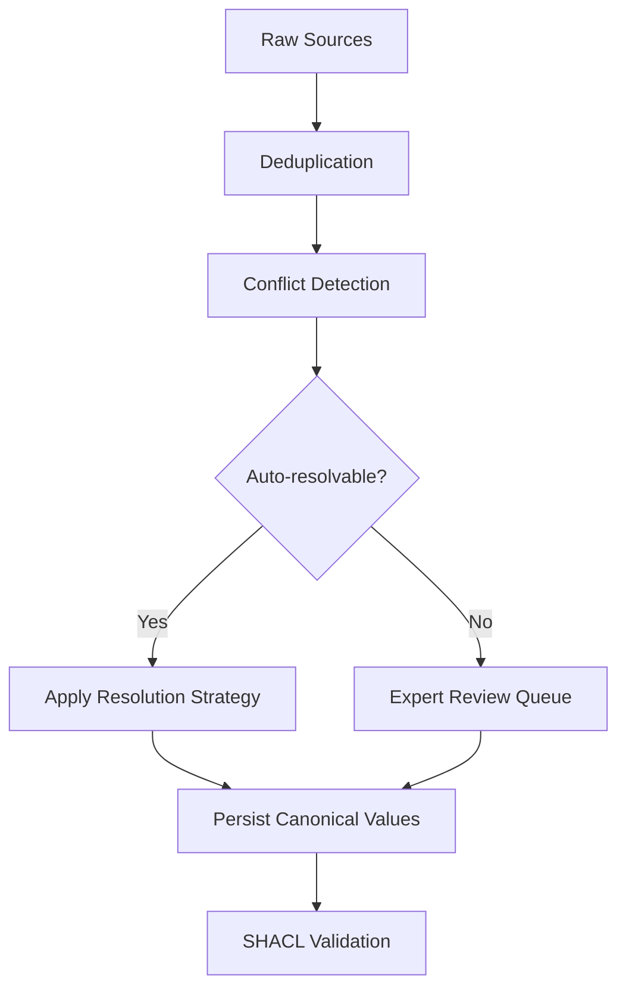

`ConflictDetector` 找出多个数据源在同一规范实体上意见不一的属性，`ConflictResolver` 则按属性应用策略——可信度加权投票、取最新值、专家审查等——产出一个带有完整审计追踪的单一解决值。请在去重之后、SHACL 校验之前运行它。

<Info>
在去重之后、SHACL 校验之前运行冲突检测。去重移除重复节点；冲突解决调和同一规范实体上相互矛盾的属性值。顺序颠倒——在去重之前检测冲突——会在本应先合并的实体之间产生虚假冲突。
</Info>

## 什么是冲突解决？

当你合并来自多个数据源的数据时，同一个现实世界实体——一位客户、一个产品、一个威胁行为者、一种药物化合物——常常带着相互矛盾的属性值出现。一个数据库说客户的邮箱是 `alice@example.com`；另一个说是 `alice.smith@example.com`。一个安全订阅源给某个 CVE 评 10.0 分；另外两个评 9.1 和 9.5。

**冲突解决** 是判定哪个值最可信、并把该决策连同证据一起记录下来的系统化过程，让规范实体的每个属性最终都有一个站得住脚、可审计的值。

### 关键概念

**规范实体** —— 一个现实世界事物的唯一权威记录。去重之后，每个实体在你的图中恰好有一个规范节点。冲突解决决定哪些属性值应该属于该节点。

**冲突值** —— 针对同一规范实体的同一属性、由不同数据源各自报告的两个或多个不同值。

**可信度分数** —— 你附加到每个源记录上的一个 0.0 到 1.0 之间的数字，表示该数据源的可靠程度。政府注册库可能携带 0.99；抓取来的博客可能只有 0.30。这些分数由你提供；Semantica 会在 `CREDIBILITY_WEIGHTED` 解决过程中使用它们。

**置信度分数** —— 解决器在解决*之后*计算出的一个 0.0 到 1.0 之间的数字，反映结果有多确定。全体一致的投票会产生高置信度；同样可信的数据源之间票数接近则产生较低置信度。它出现在 `ResolutionResult.confidence` 上，应被当作一个信号来读，而不是对解决值正确性的保证。

**解决策略** —— 挑选胜出值的规则：多数投票、可信度加权平均、最新时间戳等等。完整列表见[解决策略一览](#resolution-strategies-at-a-glance)。

**审计追踪** —— 每个解决决策的完整记录：冲突 ID、所用策略、解决值、参考过的数据源以及置信度分数。由 `resolver.get_resolution_history()` 返回。

**溯源感知的解决** —— 不仅记录胜出值、还记录它来自哪个数据源的解决方式。每个 `ResolutionResult` 都携带 `sources_used` 字段，因此你总能把一个规范值回溯到其来源——这在受监管的环境中至关重要。

## 为什么使用冲突解决？

- **多源流水线必然产生分歧。** 更新节奏、数据录入惯例和数据源可靠性上的差异不可避免。没有显式的解决步骤，你会在不留任何记录的情况下默默偏向某一个数据源。
- **你得到一份站得住脚、可审计的决策日志。** 合规团队、审计人员和领域专家需要知道哪个数据源胜出、为什么胜出。审计追踪提供的正是这些。
- **简单情况自动处理；困难情况升级处理。** 常规分歧——名称拼写略有出入、时间戳过期——由算法解决。真正模棱两可的情况——相互竞争的法律分类、不同的临床终点——会被标记出来交给专家审查，而不会阻塞流水线的其余部分。

## 何时使用 / 何时不用

**在以下情况下使用冲突解决：**
- 你正在为同一实体合并两个或更多独立数据源。
- 数据源在属性值上存在分歧，而你需要一个单一的规范值。
- 你需要一份每个解决决策都可审计的记录。
- 有些冲突需要领域专家审查之后才能解决。

**在以下情况下跳过冲突解决：**
- **已经存在单一权威数据源。** 如果某个系统对给定属性总是正确，直接从它读取。围绕单一数据源搭建解决机制只会徒增复杂度而没有收益。
- **所有数据源总是保持一致。** 跳过之前先实证验证这一点；默不作声的分歧在实践中很常见。
- **你想保留所有冲突值。** 如果保留每个数据源的主张比选出唯一胜者更重要，请把溯源直接建模到你的图 Schema 中，而不是解决成单一胜者。

## 典型工作流



1. **去重** —— 合并重复节点，让每个实体恰好有一条规范记录。冲突解决只作用于单一规范实体；在比较不同数据源对它的说法之前，你必须先识别出这个实体。参见[去重](deduplication)。
2. **冲突检测** —— 调用 `detect_entity_conflicts()` 一次性找出所有属性分歧，或调用 `detect_value_conflicts()` 针对特定属性。
3. **解决** —— 对每个冲突应用一种策略（`CREDIBILITY_WEIGHTED`、`MOST_RECENT`、`VOTING` 等），或将其转入专家审查（`EXPERT_REVIEW`）。
4. **持久化规范值** —— 把解决后的值写回你的规范实体或图存储。参见[持久化解决值](#persisting-resolved-values)。
5. **SHACL 校验** —— 在解决后的图上强制执行结构约束，确认它满足你的本体。参见[SHACL 校验](shacl-validation)。

## 快速上手：入门示例

在进入领域专属场景之前，先看穿过这条 API 的最短路径。三个系统——CRM、ERP 和一个 LDAP 目录——保存着同一客户略有出入的联系信息。三者中有两个一致认为规范邮箱是 `alice.smith@example.com`；CRM 中则是一个较旧的值。

```python
from semantica.conflicts import ConflictDetector, ConflictResolver, ResolutionStrategy

# Same customer, three sources — only email disagrees
customer_records = [
    {"id": "cust-001", "source": "crm",  "email": "alice@example.com",       "phone": "+1-555-0100"},
    {"id": "cust-001", "source": "erp",  "email": "alice.smith@example.com", "phone": "+1-555-0100"},
    {"id": "cust-001", "source": "ldap", "email": "alice.smith@example.com", "phone": "+1-555-0100"},
]

# Step 1: Detect all property conflicts at once — no need to name each property
detector = ConflictDetector()
conflicts = detector.detect_entity_conflicts(customer_records)

print(f"Conflicts found: {len(conflicts)}")
for c in conflicts:
    print(f"  Property : {c.property_name}")
    print(f"  Values   : {c.conflicting_values}")
    print(f"  Severity : {c.severity}")

# Step 2: Resolve — two out of three sources agree, so majority vote wins
resolver = ConflictResolver()
results = resolver.resolve_conflicts(conflicts, strategy=ResolutionStrategy.VOTING)

for r in results:
    print(f"\n[{'RESOLVED' if r.resolved else 'REVIEW'}] {r.conflict_id}")
    print(f"  Resolved value : {r.resolved_value}")
    print(f"  Strategy       : {r.resolution_strategy}")
    print(f"  Confidence     : {r.confidence:.0%}")
    print(f"  Sources used   : {r.sources_used}")
```

```text
Conflicts found: 1
  Property : email
  Values   : ['alice@example.com', 'alice.smith@example.com', 'alice.smith@example.com']
  Severity : medium

[RESOLVED] cust-001_email_conflict
  Resolved value : alice.smith@example.com
  Strategy       : voting
  Confidence     : 67%
  Sources used   : ['crm', 'erp', 'ldap']
```

`detect_entity_conflicts()` 自动扫描了 `email` 和 `phone` 两者——你无需逐一指名。由于 `phone` 在三条记录中完全一致，没有为它检测到冲突。邮箱分歧最终解决为 `alice.smith@example.com`，因为三个数据源中有两个认同该值。

当一批中的所有冲突都应使用同一策略时，把 `strategy=` 直接传给 `resolve_conflicts()`。当不同的实体-属性对需要不同策略时，使用 `set_resolution_rule()`——详见[设置按属性的解决规则](#setting-per-property-resolution-rules)。

## 检测冲突

`ConflictDetector` 提供三个方法。选择适合你情况的那一个：

| 方法 | 扫描内容 | 适用时机 |
| :--- | :--- | :--- |
| `detect_entity_conflicts(entities)` | 每个实体上的所有属性，一次完成 | 第一遍扫描；你事先不知道哪些属性有冲突 |
| `detect_value_conflicts(entities, property_name)` | 所有实体上的某一个具名属性 | 对已知热点属性做定点检查 |
| `detect_relationship_conflicts(relationships)` | 同一节点对之间的边类型 | 图边中的结构性分歧 |

### 一次扫描所有属性——`detect_entity_conflicts`

`detect_entity_conflicts()` 是新流水线推荐的起点。它检查实体记录上发现的每一个属性，并在一次调用中返回包含所有冲突的单一扁平列表——无需你预先枚举属性。

```python
detector = ConflictDetector()
all_conflicts = detector.detect_entity_conflicts(records)
# Returns every conflict across every property in one call
```

如果你已为某个实体类型注册了冲突字段，传入 `entity_type` 可把检测限制在这些字段上：

```python
# Limit detection to fields registered for this entity type
all_conflicts = detector.detect_entity_conflicts(records, entity_type="vulnerability")
```

不传 `entity_type` 时，检测器会检查实体 dict 上发现的每个键（排除 `id`、`source`、`metadata` 之类管理性字段）。从这里开始获得全貌，然后决定哪些冲突需要哪种解决策略。

### 扫描特定属性——`detect_value_conflicts`

当你已经知道要检查哪个属性，或想对每个属性应用不同的检测逻辑时，使用 `detect_value_conflicts()`。`ConflictDetector` 按实体 ID 对记录分组，然后比较每个数据源在该属性上的值。任何有两个或更多数据源报告不同值的实体都会产生一个 `Conflict` 对象。

```python
from semantica.conflicts import ConflictDetector, ConflictResolver, ResolutionStrategy

# Three authoritative sources on the same CVE — all credible, all disagreeing
cve_records = [
    {
        "id": "cve-2024-3400",
        "source": "nvd",
        "cvss_score": 10.0,
        "exploit_status": "unconfirmed",
        "vector": "AV:N/AC:L/PR:N/UI:N/S:C/C:H/I:H/A:H",
        "metadata": {"timestamp": "2024-04-11T12:00:00Z"},
    },
    {
        "id": "cve-2024-3400",
        "source": "commercial_feed",
        "cvss_score": 9.1,
        "exploit_status": "in_wild",
        "vector": "AV:N/AC:L/PR:N/UI:N/S:U/C:H/I:H/A:H",
        "metadata": {"timestamp": "2024-04-12T15:30:00Z"},
    },
    {
        "id": "cve-2024-3400",
        "source": "vendor_paloalto",
        "cvss_score": 9.5,
        "exploit_status": "in_wild",
        "vector": "AV:N/AC:H/PR:N/UI:N/S:C/C:H/I:H/A:H",
        "metadata": {"timestamp": "2024-04-12T12:00:00Z"},
    },
]

detector = ConflictDetector()

# Detect disagreements on the CVSS score property
score_conflicts = detector.detect_value_conflicts(cve_records, property_name="cvss_score")
exploit_conflicts = detector.detect_value_conflicts(cve_records, property_name="exploit_status")

print(f"CVSS score conflicts  : {len(score_conflicts)}")
print(f"Exploit status conflicts: {len(exploit_conflicts)}")

for c in score_conflicts:
    print(f"\nConflict: {c.conflict_id}")
    print(f"  Entity   : {c.entity_id}")
    print(f"  Property : {c.property_name}")
    print(f"  Values   : {c.conflicting_values}")   # [10.0, 9.1, 9.5]
    print(f"  Severity : {c.severity}")              # 'medium' — numeric difference < 1000
    print(f"  Sources  : {[s['document'] for s in c.sources]}")
    print(f"  Action   : {c.recommended_action}")
```

```text
CVSS score conflicts  : 1
Exploit status conflicts: 1

Conflict: cve-2024-3400_cvss_score_conflict
  Entity   : cve-2024-3400
  Property : cvss_score
  Values   : [10.0, 9.1, 9.5]
  Severity : medium
  Sources  : ['nvd', 'commercial_feed', 'vendor_paloalto']
  Action   : Multiple conflicting values detected. Manual review recommended.
```

每个 `Conflict` 都捕获了全貌：哪个实体、哪个属性、每个相互矛盾的值，以及每个值由哪个数据源报告。这已经足以搭建一个审查队列——但目标还是按照你设定的规则自动解决这些冲突。

## 设置按属性的解决规则

`set_resolution_rule(entity_id, property_name, strategy)` 为特定的实体-属性组合注册一个策略。解决器把规则存储在 `entity_id.property_name` 键下，并在你调用 `resolve_conflicts()` 时自动应用。

因为规则同时以实体 ID 和属性名为键，`set_resolution_rule()` 是实体级的。不存在能一次把规则应用到所有实体或所有属性的通配符。

**何时使用 `set_resolution_rule()`：** 当不同的实体-属性组合需要不同策略时使用它。例如，一个实体的 `legal_name` 可能用 `CREDIBILITY_WEIGHTED`，而它的 `last_updated` 用 `MOST_RECENT`。为每个组合注册规则，让单次 `resolve_conflicts()` 调用一次性正确处理所有这些。

**何时把 `strategy=` 直接传给 `resolve_conflicts()`：** 如果一批中的每个冲突都应使用同一策略，直接把它传给 `resolve_conflicts()`，而不是为每个实体-属性对注册规则：

```python
# Same strategy for every conflict — no per-property rules needed
results = resolver.resolve_conflicts(all_conflicts, strategy=ResolutionStrategy.CREDIBILITY_WEIGHTED)
```

这比为了处处应用同一策略而在循环里对每个实体调用 `set_resolution_rule()` 干净得多。

**CVE 示例的按属性规则：**

```python
resolver = ConflictResolver()

# Register source credibility scores so CREDIBILITY_WEIGHTED can use them
resolver.source_tracker.set_source_credibility("nvd", 0.98)
resolver.source_tracker.set_source_credibility("commercial_feed", 0.91)
resolver.source_tracker.set_source_credibility("vendor_paloalto", 0.87)

# For this CVE, NVD is the most authoritative source on scoring.
# CREDIBILITY_WEIGHTED uses the registered source credibility 
# to weight the vote — NVD at 0.98 will dominate over the commercial feed at 0.91.
resolver.set_resolution_rule(
    "cve-2024-3400",
    "cvss_score",
    ResolutionStrategy.CREDIBILITY_WEIGHTED,
)

# Exploitation status is time-sensitive: the commercial feed and vendor have both
# observed in-the-wild exploitation, which is more current than NVD's initial
# unconfirmed assessment. MOST_RECENT picks the value from the source with the
# latest timestamp in its metadata.
resolver.set_resolution_rule(
    "cve-2024-3400",
    "exploit_status",
    ResolutionStrategy.MOST_RECENT,
)
```

你可以在检测之前或之后设置规则——解决器会在调用 `resolve_conflicts()` 时惰性地应用它们。

## 解决整批冲突

把检测到的所有冲突传给 `resolve_conflicts()`。对每个冲突，解决器会查找是否为该实体-属性组合注册了规则。如果找到，就应用该策略。如果没有设置，则回退到默认策略（投票，除非你在构造函数中覆盖了它）。

```python
all_conflicts = score_conflicts + exploit_conflicts

results = resolver.resolve_conflicts(all_conflicts)

for r in results:
    status = "RESOLVED" if r.resolved else "REVIEW REQUIRED"
    print(f"[{status}] {r.conflict_id}")
    print(f"  Resolved value : {r.resolved_value}")
    print(f"  Strategy used  : {r.resolution_strategy}")
    print(f"  Confidence     : {r.confidence:.0%}")
    print(f"  Sources used   : {r.sources_used}")
    print(f"  Notes          : {r.resolution_notes}")
    print()
```

```text
[RESOLVED] cve-2024-3400_cvss_score_conflict
  Resolved value : 10.0
  Strategy used  : credibility_weighted
  Confidence     : 36%
  Sources used   : ['nvd', 'commercial_feed', 'vendor_paloalto']
  Notes          : Resolved by credibility-weighted voting (weight: 0.98)

[RESOLVED] cve-2024-3400_exploit_status_conflict
  Resolved value : in_wild
  Strategy used  : most_recent
  Confidence     : 80%
  Sources used   : ['commercial_feed']
  Notes          : Resolved by most recent value
```

NVD 赢得了 CVSS 分数——它的可信度权重（0.98）略胜商业订阅源（0.91）和厂商（0.87）一筹，于是 10.0 成为规范分数。利用状态的分歧解决为 `in_wild`——商业订阅源和厂商公告都比 NVD 的初步研判更新，且两者都报告了在野利用。

## 处理需要人工判断的冲突

并非每个冲突都能自动解决。关于金融工具法律分类的分歧，或关于患者当前用药清单的分歧，后果太重大，不能交给算法。把这些标记出来供审查，而不阻塞批中其余部分：

```python
from semantica.conflicts import ConflictDetector, ConflictResolver, ResolutionStrategy

# Drug trial data: efficacy agreed, primary endpoint disputed
trial_records = [
    {"id": "dapagliflozin", "source": "declare_timi58",
     "primary_endpoint": "MACE",               "hba1c_reduction_pct": 0.54},
    {"id": "dapagliflozin", "source": "dapa_hf",
     "primary_endpoint": "HF_hospitalization", "hba1c_reduction_pct": 0.48},
    {"id": "dapagliflozin", "source": "meta_analysis",
     "primary_endpoint": "HbA1c_reduction",    "hba1c_reduction_pct": 0.52},
]

detector = ConflictDetector()
efficacy_conflicts  = detector.detect_value_conflicts(trial_records, "hba1c_reduction_pct")
endpoint_conflicts  = detector.detect_value_conflicts(trial_records, "primary_endpoint")

resolver = ConflictResolver()

# Register source credibility scores
resolver.source_tracker.set_source_credibility("declare_timi58", 0.92)
resolver.source_tracker.set_source_credibility("dapa_hf", 0.95)
resolver.source_tracker.set_source_credibility("meta_analysis", 0.88)

# Efficacy: credibility-weighted across trials — the meta-analysis (0.88) and
# the two RCTs (0.92, 0.95) will produce a weighted resolution.
resolver.set_resolution_rule(
    "dapagliflozin", "hba1c_reduction_pct", ResolutionStrategy.CREDIBILITY_WEIGHTED
)

# Primary endpoint: each trial measured a different thing. This is not a conflict
# to auto-resolve — a clinician must decide which endpoint applies to the use case.
resolver.set_resolution_rule(
    "dapagliflozin", "primary_endpoint", ResolutionStrategy.EXPERT_REVIEW
)

all_conflicts = efficacy_conflicts + endpoint_conflicts
results = resolver.resolve_conflicts(all_conflicts)

auto_resolved = [r for r in results if r.resolved]
for_review    = [r for r in results if not r.resolved]

print(f"Auto-resolved : {len(auto_resolved)}")
print(f"Expert review : {len(for_review)}")

# Export the review queue for the clinical team
import json
review_queue = [
    {
        "conflict_id": r.conflict_id,
        "notes": r.resolution_notes,
        "metadata": r.metadata,
    }
    for r in for_review
]
with open("expert_review_queue.json", "w") as fh:
    json.dump(review_queue, fh, indent=2, default=str)
```

```text
Auto-resolved : 1
Expert review : 1   # primary_endpoint — EXPERT_REVIEW means resolved=False
```

`EXPERT_REVIEW` 会在结果上设置 `resolved=False`。冲突在图中保持未解决状态，metadata 字段携带 `requires_expert_review: True`，而审查队列 JSON 恰好为你的临床团队提供了做出判断所需的一切。

## 持久化解决值

`resolve_conflicts()` 返回 `ResolutionResult` 对象——它不会自动把解决值写回你的图或实体存储。这一步要由你使用流水线所用的任何存储层来实现。

最直接的做法是把每个 `ResolutionResult` 与它对应的原始 `Conflict` 对象配对——两个列表按相同顺序返回——并把胜出值写到你的规范实体上：

```python
# canonical_entity is your authoritative record — a dict, graph node, database row, etc.
canonical_entity = {"id": "cve-2024-3400", "cvss_score": None, "exploit_status": None}

for conflict, result in zip(all_conflicts, results):
    if result.resolved:
        canonical_entity[conflict.property_name] = result.resolved_value
        # Log provenance: record which source this value came from
        print(f"  {conflict.property_name} = {result.resolved_value} "
              f"(from {result.sources_used}, confidence {result.confidence:.0%})")

# Persist canonical_entity to your graph store, database, or downstream system.
```

```text
  cvss_score = 10.0 (from ['nvd', 'commercial_feed', 'vendor_paloalto'], confidence 36%)
  exploit_status = in_wild (from ['commercial_feed'], confidence 80%)
```

有几点要记住：

- **`resolved=False` 的冲突**——被标记为需要专家或人工审查——在有人做出判断之前，不应写入规范记录。把它们留在审查队列里。
- **置信度是信号，不是保证。** 72% 的置信度分数意味着解决器掌握的证据充分但并非全体一致。在把低置信度的结果写入生产之前，要加以额外的审视。
- **追踪溯源。** `result.sources_used` 告诉你哪个数据源的值胜出了。如果你的合规要求完整的证据链，请把它与规范值一起存储。

## 查看完整审计追踪

解决运行之后，`get_resolution_history()` 返回自解决器实例化以来做出的每个决策。这就是你的合规日志：

```python
history = resolver.get_resolution_history()

print(f"Total resolutions logged: {len(history)}")
for r in history:
    status = "RESOLVED" if r.resolved else "PENDING"
    print(f"[{status}] {r.conflict_id}")
    print(f"  Strategy   : {r.resolution_strategy}")
    print(f"  Value      : {r.resolved_value}")
    print(f"  Confidence : {r.confidence:.0%}")
```

把它与检测器的完整冲突报告配合使用，即可得到跨所有运行的汇总统计：

```python
report = detector.get_conflict_report()

print(f"Total conflicts detected  : {report['total_conflicts']}")
print(f"By type                   : {report['by_type']}")
print(f"By severity               : {report['by_severity']}")
# Total conflicts detected  : 6
# By type                   : {'value_conflict': 6}
# By severity               : {'medium': 6}
```

这份报告汇总了检测器在其生命周期内见到的每一个冲突——可用于流水线监控，也可用于识别哪些实体类型或数据源产生了最多的分歧。

## 检测关系冲突

值冲突存在于属性上。关系冲突存在于边上——两个数据源对同一节点对之间的连接做出相互矛盾的断言：

```python
# Two intelligence sources disagree about whether APT29 exploits this CVE
relationships = [
    {"source": "apt29", "target": "cve-2024-3400",
     "type": "EXPLOITS",     "origin": "mandiant"},
    {"source": "apt29", "target": "cve-2024-3400",
     "type": "UNRELATED_TO", "origin": "crowdstrike"},
]

rel_conflicts = detector.detect_relationship_conflicts(relationships)
for c in rel_conflicts:
    print(f"Relationship conflict: {c.conflict_id}")
    print(f"  Edge type values: {c.conflicting_values}")
    print(f"  Severity: {c.severity}")
```

关系冲突通常需要专家审查而不是投票，因为相互矛盾的边类型往往反映的是真正不同的情报判断，而不是数据录入错误。

## 领域示例

<Tabs>

<Tab title="国防——CTI/威胁">

一个威胁情报平台合并来自 Mandiant、CrowdStrike 和一个开源博客的行为者档案。三个数据源一致认为 APT29 来自俄罗斯、以间谍活动为动机，但在它首次被观测到的时间上存在分歧，而且——关键的是——其中有一个数据源把它归因于中国。当高可信度数据源（Mandiant 0.95、CrowdStrike 0.92）意见一致时，低可信度数据源（那个博客，0.30）应当落败。

可信度加权解决干净利落地处理了这一点：博客的错误归因被两家权威厂商的合并权重所淹没。`first_seen` 日期的分歧（2008 对 2009）同样由可信度权重解决，让 Mandiant 的 2008 胜出。

```python
from semantica.conflicts import ConflictDetector, ConflictResolver, ResolutionStrategy

actor_profiles = [
    {"id": "apt29", "source": "mandiant",    "nation_state": "Russia",
     "first_seen": "2008"},
    {"id": "apt29", "source": "crowdstrike", "nation_state": "Russia",
     "first_seen": "2009"},
    {"id": "apt29", "source": "oss_blog",    "nation_state": "China",  # wrong
     "first_seen": "2015"},
]

detector = ConflictDetector()
nation_conflicts     = detector.detect_value_conflicts(actor_profiles, "nation_state")
first_seen_conflicts = detector.detect_value_conflicts(actor_profiles, "first_seen")

resolver = ConflictResolver()
resolver.source_tracker.set_source_credibility("mandiant", 0.95)
resolver.source_tracker.set_source_credibility("crowdstrike", 0.92)
resolver.source_tracker.set_source_credibility("oss_blog", 0.30)

resolver.set_resolution_rule("apt29", "nation_state", ResolutionStrategy.CREDIBILITY_WEIGHTED)
resolver.set_resolution_rule("apt29", "first_seen",   ResolutionStrategy.CREDIBILITY_WEIGHTED)

results = resolver.resolve_conflicts(nation_conflicts + first_seen_conflicts)
for r in results:
    print(f"{r.conflict_id}: {r.resolved_value!r}  [{r.confidence:.0%} confidence]")
    # apt29_nation_state_conflict: 'Russia'  [86% confidence]
    # apt29_first_seen_conflict:   '2008'    [44% confidence]
    # The blog's China attribution (weight 0.30) loses to Mandiant+CrowdStrike (0.95+0.92).

history = resolver.get_resolution_history()
print(f"Audit log entries: {len(history)}")
```

</Tab>

<Tab title="安全——SOC/事件">

一个漏洞管理系统针对同一个 CVE 从 NVD、MITRE 和一份厂商公告摄取 CVSS 分数。NVD 和 MITRE 都是权威来源；厂商出于自身利益倾向保守评分。可信度加权解决让 NVD（0.98）和 MITRE（0.96）压过厂商（0.90），产出一个反映各独立权威共识的规范分数。

CVSS 向量字符串也存在冲突——scope 字段（`S:C` 对 `S:U`）反映的是一种真实的解释性分歧，会影响该 CVE 是否被归类为网络跳板风险。两个冲突得到同样的可信度加权处理。

```python
from semantica.conflicts import ConflictDetector, ConflictResolver, ResolutionStrategy

cve_records = [
    {"id": "cve-2024-3400", "source": "nvd",
     "cvss_score": 10.0, "vector": "AV:N/AC:L/PR:N/UI:N/S:C/C:H/I:H/A:H"},
    {"id": "cve-2024-3400", "source": "mitre",
     "cvss_score": 9.8,  "vector": "AV:N/AC:L/PR:N/UI:N/S:U/C:H/I:H/A:H"},
    {"id": "cve-2024-3400", "source": "paloalto",
     "cvss_score": 9.5,  "vector": "AV:N/AC:H/PR:N/UI:N/S:C/C:H/I:H/A:H"},
]

detector = ConflictDetector()
score_conflicts  = detector.detect_value_conflicts(cve_records, "cvss_score")
vector_conflicts = detector.detect_value_conflicts(cve_records, "vector")

resolver = ConflictResolver()
resolver.source_tracker.set_source_credibility("nvd", 0.98)
resolver.source_tracker.set_source_credibility("mitre", 0.96)
resolver.source_tracker.set_source_credibility("paloalto", 0.90)

resolver.set_resolution_rule(
    "cve-2024-3400", "cvss_score", ResolutionStrategy.CREDIBILITY_WEIGHTED
)
resolver.set_resolution_rule(
    "cve-2024-3400", "vector", ResolutionStrategy.CREDIBILITY_WEIGHTED
)

results = resolver.resolve_conflicts(score_conflicts + vector_conflicts)
for r in results:
    if r.resolved:
        print(f"Canonical {r.conflict_id.split('_')[2]}: {r.resolved_value}  "
              f"({r.confidence:.0%} confidence)")
    # Canonical cvss_score: 10.0   (35% confidence)  — NVD wins
    # Canonical vector: AV:N/AC:L/PR:N/UI:N/S:C/C:H/I:H/A:H  (35% confidence)
```

</Tab>

<Tab title="生命科学——临床/制药">

一张药物安全知识图谱合并来自三项研究的达格列净（dapagliflozin）试验数据：DECLARE-TIMI 58、DAPA-HF 和一项荟萃分析。HbA1c 降幅在各试验之间不同，因为每项试验入组的人群不同。主要终点各不相同，则是因为每项试验的设计都是为了回答不同的临床问题——这是真实的科学差异，不是数据错误。

疗效数字可以做可信度加权；有争议的终点必须交给专家审查。这种区别处理——能自动解决的自动解决，不能的升级处理——正是受监管数据环境的标准做法。

```python
from semantica.conflicts import ConflictDetector, ConflictResolver, ResolutionStrategy

drug_records = [
    {"id": "dapagliflozin", "source": "declare_timi58",
     "hba1c_reduction_pct": 0.54, "primary_endpoint": "MACE"},
    {"id": "dapagliflozin", "source": "dapa_hf",
     "hba1c_reduction_pct": 0.48, "primary_endpoint": "HF_hospitalization"},
    {"id": "dapagliflozin", "source": "meta_analysis",
     "hba1c_reduction_pct": 0.52, "primary_endpoint": "HbA1c_reduction"},
]

detector = ConflictDetector()
efficacy_conflicts = detector.detect_value_conflicts(drug_records, "hba1c_reduction_pct")
endpoint_conflicts = detector.detect_value_conflicts(drug_records, "primary_endpoint")

resolver = ConflictResolver()
resolver.source_tracker.set_source_credibility("declare_timi58", 0.92)
resolver.source_tracker.set_source_credibility("dapa_hf", 0.95)
resolver.source_tracker.set_source_credibility("meta_analysis", 0.88)

resolver.set_resolution_rule(
    "dapagliflozin", "hba1c_reduction_pct", ResolutionStrategy.CREDIBILITY_WEIGHTED
)
resolver.set_resolution_rule(
    "dapagliflozin", "primary_endpoint", ResolutionStrategy.EXPERT_REVIEW
    # resolved=False — queued for clinician review, not auto-resolved
)

results = resolver.resolve_conflicts(efficacy_conflicts + endpoint_conflicts)
auto   = [r for r in results if r.resolved]
review = [r for r in results if not r.resolved]

print(f"Auto-resolved  : {len(auto)}")
for r in auto:
    print(f"  {r.conflict_id}: {r.resolved_value}  [{r.confidence:.0%}]")
    # dapagliflozin_hba1c_reduction_pct_conflict: 0.48  [35%]

print(f"Expert queue   : {len(review)}")
for r in review:
    print(f"  {r.conflict_id} — {r.resolution_notes}")
    # dapagliflozin_primary_endpoint_conflict — Flagged for expert review
```

</Tab>

<Tab title="银行业——风险/合规">

一张信用风险图谱合并来自 CRM、全球 LEI 注册库和一家征信机构的企业客户数据。LEI 注册库是实体名称和行业代码的法定权威——它的可信度应设为 1.0（或当作定论对待）。CRM 和征信机构可能持有陈旧或缩写的名称；LEI 注册库保有正式注册的法定名称。

为 `legal_name` 和 `sic_code` 设置 `CREDIBILITY_WEIGHTED` 解决，并让 LEI 注册库携带 0.99 的可信度分数，即可确保法律上权威的值总是胜出，并为下一次监管检查备好完整的审计证据。

```python
from semantica.conflicts import ConflictDetector, ConflictResolver, ResolutionStrategy

client_records = [
    {"id": "corp-acme-uk", "source": "crm",
     "legal_name": "ACME UK Ltd",                "sic_code": "7372"},
    {"id": "corp-acme-uk", "source": "lei_registry",
     "legal_name": "ACME United Kingdom Limited", "sic_code": "7371"},
    {"id": "corp-acme-uk", "source": "credit_bureau",
     "legal_name": "ACME UK Ltd",                "sic_code": "7372"},
]

detector = ConflictDetector()
name_conflicts = detector.detect_value_conflicts(client_records, "legal_name")
sic_conflicts  = detector.detect_value_conflicts(client_records, "sic_code")

resolver = ConflictResolver()
resolver.source_tracker.set_source_credibility("lei_registry", 0.99)
resolver.source_tracker.set_source_credibility("credit_bureau", 0.50)
resolver.source_tracker.set_source_credibility("crm", 0.40)

resolver.set_resolution_rule(
    "corp-acme-uk", "legal_name", ResolutionStrategy.CREDIBILITY_WEIGHTED
)
resolver.set_resolution_rule(
    "corp-acme-uk", "sic_code", ResolutionStrategy.CREDIBILITY_WEIGHTED
)

results = resolver.resolve_conflicts(name_conflicts + sic_conflicts)
for r in results:
    print(f"Canonical {r.conflict_id.split('_')[1]}: {r.resolved_value!r}  "
          f"[{r.confidence:.0%}]")
    # Canonical legal_name: 'ACME United Kingdom Limited'  [52%]  — LEI registry wins
    # Canonical sic_code:   '7371'                         [52%]  — LEI registry wins

# Aggregate conflict statistics for the compliance report
report = detector.get_conflict_report()
print(f"\nConflict audit:")
print(f"  Total detected : {report['total_conflicts']}")
print(f"  By severity    : {report['by_severity']}")
```

</Tab>

</Tabs>

## 解决策略一览

| 策略 | 决策方式 | 最佳场景 |
| :--- | :--- | :--- |
| `VOTING` | 最常见的值胜出 | 3 个以上独立数据源；没有明确权威 |
| `CREDIBILITY_WEIGHTED` | 按数据源的 `credibility_score` 加权 | 数据源有已知的可靠性排名 |
| `MOST_RECENT` | 取时间戳最新的数据源的值 | 数据很快失效——威胁情报、市场价格 |
| `FIRST_SEEN` | 取第一个断言该值的数据源的值 | 一手数据源比衍生数据源更可靠 |
| `HIGHEST_CONFIDENCE` | 取 `confidence` 字段最高的数据源的值 | 自动抽取器会输出逐记录的置信度分数 |
| `MANUAL_REVIEW` | 标记冲突；`resolved=False` | 低数量、高利害的决策 |
| `EXPERT_REVIEW` | 标记进入领域专家队列；`resolved=False` | 需要科学或法律层面的消歧 |

## 常见陷阱

**在去重之前运行冲突解决**
如果同一现实世界实体的重复节点仍然存在，`ConflictDetector` 会把每个重复项当作一个与其他重复项意见不一的独立实体——产生本不应存在的虚假冲突。务必先运行去重。

**忘记持久化解决值**
`resolve_conflicts()` 返回 `ResolutionResult` 对象；它不会把结果写到任何地方。查看完结果就直接走人、不更新规范实体，意味着你的数据实际上什么都没变。参见[持久化解决值](#persisting-resolved-values)。

**在大实体集上逐个属性扫描**
在手动循环中对每个属性调用 `detect_value_conflicts()`，会对数据产生冗余的多次遍历。改用 `detect_entity_conflicts()`——它在单次调用中处理所有属性，是批量检测的推荐起点。

**误解可信度分数**
可信度分数是你基于对数据源可靠性的先验认知赋予的权重——不是基准真值。用 `set_source_credibility("source", 0.99)` 注册的数据源仍然可能出错。`CREDIBILITY_WEIGHTED` 解决会放大你对数据源质量的信念；如果这些信念校准失准，解决结果也会随之失准。在生产中依赖这些分数之前，先用已知的基准真值验证它们。

**把解决值当作有保证的真理**
解决值是在你的数据源和策略之下最站得住脚的答案——未必是正确的那个。低置信度分数和 `EXPERT_REVIEW` 标记都是信号，提醒你在写入规范记录或下游系统之前仔细审查结果。

**在已存在单一权威数据源时仍使用冲突解决**
如果某个系统对给定属性总是正确，直接从它读取。在单一数据源之上叠加冲突解决机制会增加复杂度、引入不必要的疑虑，并产生不包含任何真实信息的审计追踪。

**在循环中注册规则来统一应用一种策略**
为了让所有冲突应用同一策略而对每个实体-属性对都调用 `set_resolution_rule()`，会平白制造 O(N) 的设置成本。当一种策略就能覆盖整批冲突时，把 `strategy=` 直接传给 `resolve_conflicts()`。

## 相关指南

- [去重](deduplication)——在运行冲突检测之前移除重复节点
- [溯源](provenance)——追踪每个解决值来自哪个数据源，并以密码学方式验证审计追踪
- [SHACL 校验](shacl-validation)——在冲突解决之后强制执行结构约束
- [变更管理](change-management)——在冲突解决运行前后对图做快照
- [本体管理](ontology)——把实体类型对齐到共享词汇表，以在 Schema 层面减少类型冲突
